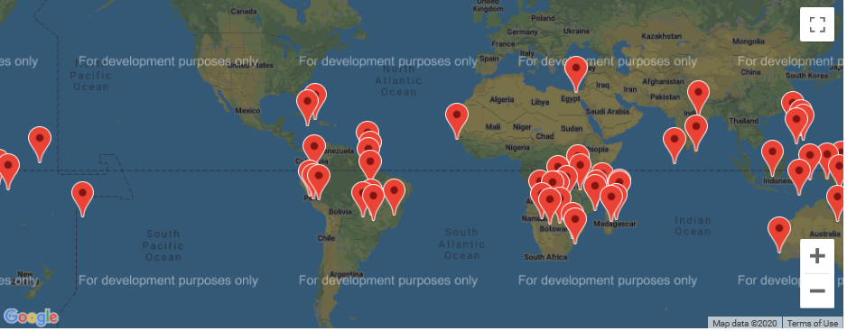
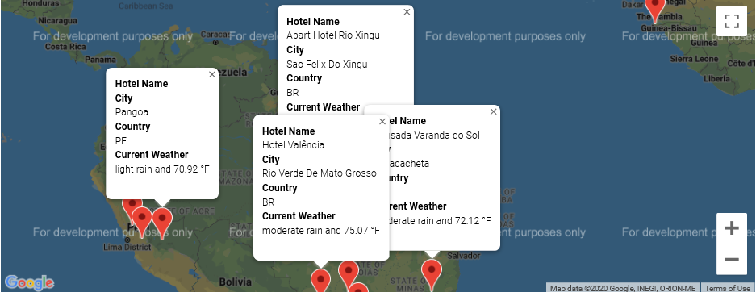
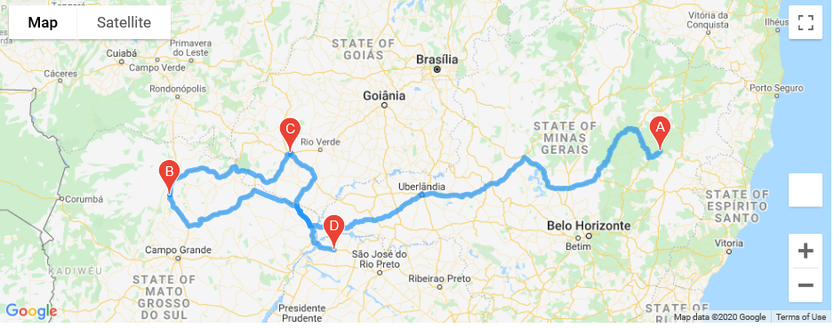
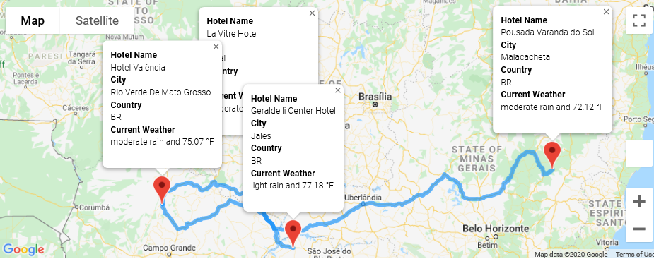

# World Weather Analysis 
Weather Analysis and building of a travel app for customers of 600+ cities around the world.

## Project Overview
In this project, a travel app for customers is built using weather data of 600+ cities along with the data to recommend ideal hotels based on clients’ weather preferences.

## Tools
Python, citipy, Pandas, Matplotlib, SciPy, Google Maps API, Google Places API, OpenWeatherMap API, Jupyter Notebook

## Summary

- The Travel App allows customers to search for locations they want to travel based on their temperature preferences. 

- Once the customers have filtered the database (DataFrame) based on their temperature preferences, a heatmap will be showed to them for the maximum temperature 
for the filtered cities.

- A notation is in the search criteria to indicate if it is raining or snowing for customers who are making travel decisions in real-time.

- Now that the map have all the cities the customer wants to travel to, they will need to find a hotel to stay in the city.

- A map that shows the directions between multiple cities for customers’ travel itinerary will be displayed.

- A map that shows the directions between multiple cities with the details of the nearest hotel for customers’ travel itinerary will be also be displayed if selected by the cutomer.

